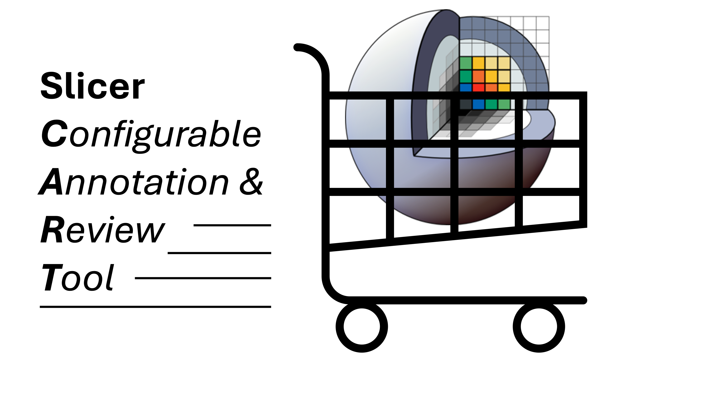

# SlicerCART

SlicerCART : Configurable Annotation and Review Tool. 

## Description

* 3D Slicer extension
* Adapted from code of Dr. Laurent Létourneau-Guillon and his team in [ICH_SEGMENTER_V2](https://github.com/laurentletg/ICH_SEGMENTER_V2), [SlicerCART](https://github.com/laurentletg/SlicerCART), and [Brain_Extraction](https://github.com/MattFr56/CT_Brain_Extraction/blob/main/Brain_Extraction/Brain_Extraction/Brain_Extraction.py). This is an effort to create a unified code for a configurable 3D Slicer extension. 
* Inspired from [Neuropoly](https://neuro.polymtl.ca/)'s workflow. 
* This tool is made to improve manual segmentation and classification workflows across different teams. 

**Keywords:** medical imaging, manual segmentation, manual correction, workflow, ground-truth segmentation, quality control

**Abbreviations:**

- MRI - Magnetic Resonance Imaging
- CT - Computed Tomography
- BIDS - Brain Imaging Data Structure
- GUI - Graphical User Interface
- QC - Quality Control

**Rationale:**

* Manual segmentation and classification tasks are required in the research setting related to medical imaging artificial intelligence tool development
* An open-source solution for such tasks would better benefit the research setting
* Actual open-source solutions that enable imaging viewing and annotation are not optimal from an end-user standpoint (especially from various background), increasing the already high burden of manual segmentation and classification tasks
* A workflow aimed to efficiently navigate through a dataset while performing manual segmentation / correction, including revision steps and robust annotation consistency assessment is crucial for handling large amount of data and provide the best ground-truth references segmentation as possible. 

**Module specific functions (in details)**

This module has been adapted to perform several tasks. Among other things, it allows the user to:

* Customize configuration preferences (see below for details)
* Customize keyboard shortcuts
* Identify the name, degree and revision step related to the human annotator
* Select folder of interest where volumes are saved (and possibly impose BIDS)
* Select the output folder where processing and work is preferred to be saved
* Select a ground-truth folder where references studies can be used for iterative self-assessment
* Display in the GUI a case list of all the studies of interests for the segmentation task (*from a site directory or a customized list)
* Select from the GUI case list any volume of interest to display
* Navigate through case list from next and previous buttons
* Load automatically the first remaining case for segmentation in a customized list
* Create automatically all required segments that may be used according to the project configuration each time a volume is displayed
* Toggle interpolation of the volume loaded
* Execute multiple automated functions when saving segmentation masks for a given volume. Indeed, the automated functions:
  * Save segmentation masks in the selected output folder with volume file hierarchy
  * Track the different versions (save the following version if previous version(s) already exist(s)) **N.B. limitation to 99 versions for a single volume*
  * Save a .csv file with segmentation statistics (e.g. subject, annotator's name and degree, revision step, date and time, total duration, duration of each label annotation)
  * Save a .csv file with classification statistics (e.g. subject, annotator's name and degree, revision step, date and time, checkboxes / dropdown / free text fields)
  * Go to the next remaining case and make it ready to segment without any further action
* Load a pre-existing segmentation for further modification (will be saved as a new version of the segmentation)

### Requirements

* MacOS Sonoma or Sequoia is recommended 
* A working version of [3D Slicer](https://download.slicer.org).
  * N.B. The version currently used to develop this module is the version 5.6.2 (most stable release as of 2024-10-22). The version 5.2.2 has also been used.

This module has been developed on:

* MacOS Sonoma version 14.1.1 and Sequoia 15.0.1
* 3D Slicer version 5.6.2

Although it may work on other versions and/or operating system, please note that it has not been tested.

## Installation steps

If previous version of Slicer ---» delete the app. If on MacOS, you can do it by doing right lick on the app in the application folder --- move to trash --- go to trash --- empty the trash --- restart your computer.

1. Install [3D Slicer](https://download.slicer.org).  
2. Clone this repository in the location of your choice.
3. Then, go in the finder --- find the file SlicerCART.py file, and copy the pathname.
4. Open 3D Slicer.
5. Activate the checkbox `Enable developer mode` in `Edit -> Application Settings -> Developer -> Enable developer mode`. 
6. Add the path of the `SlicerCART.py` file in `Edit -> Application Settings -> Modules -> Additional module paths`.(N.B. 1) You must have the file: if it is the folder path, then the module will not work; 2) in the Additional modul path section, the path copied might be shown to the folder: this is a Slicer thing, and should not affect working property of the module if it was the file that you copied).
7. The module can be found under `Examples -> SlicerCART`: the module should now be opened (N.B. 1) If first use, you may have additional requirements to install. A pop-up window from Slicer advertising you should pop-up if so: just click ok).
8. (Optional) Set the SlicerCART module to launch at 3DSlicer startup. To do so, go to `Edit -> Application Settings -> Modules -> Default startup module`
9. There might be errors. These would be seen in the Python Console: if any errors, we highly recommend you to fix them before any further use!

### Trouble shooting 

* Qt might need to be installed. The first five steps of the following procedure might be useful for this: [procedure](https://web.stanford.edu/dept/cs_edu/resources/qt/install-mac). 

### Other extensions that could be useful
* `SlicerJupyter` to be able to use Jupyter Notebooks connected to 3D Slicer.

### Documentation
TODO (after sufficient development has been made)

### Video tutorials 
TODO (after sufficient development has been made)

### Other resources
* [3D Slicer Tutorials](https://www.youtube.com/watch?v=QTEti9aY0vs&)
* [3D Slicer Documentation](https://www.slicer.org/wiki/Documentation/Nightly/Training)

### Contributors

* Laurent Létourneau-Guillon
* Emmanuel Montagnon
* An Ni Wu
* Maxime Bouthillier
* Delphine Pilon
* Neuropoly Team
